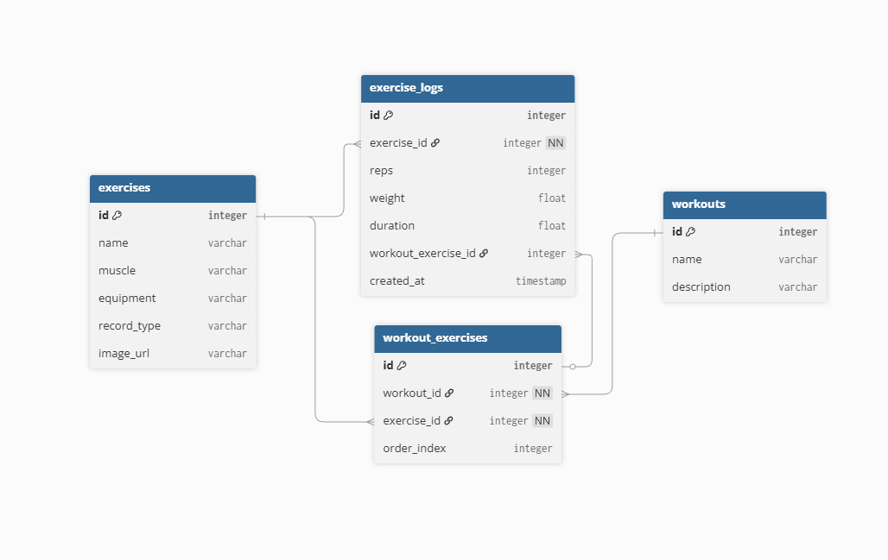

# Apecs

**Apecs** is a fitness tracking application designed for users who want to keep track of data. Built with **React Native** and a robust **SQLite** backend, Apecs ensures your data stays local, fast, and secure.

---

## 📱 Demo

---

## 🚀 Core Features
### 1. Exercise Management
- **Custom Exercise Creation**: Define exercises with specific metadata including primary muscle, secondary muscle, and equipment.
- **UI**: Automatically hides "Other" or "None" placeholders in headers to keep the interface focused on relevant anatomy.
- **Dynamic Record Types**: Supports tracking by **Weight and Reps** or **Time** (seconds) depending on the exercise needs.

### 2. Structured Workout Architecture
- **Routine Builder**: Organize multiple exercises into structured workouts with defined sets, reps, and order.
- **Relational Integrity**: Uses a many-to-many relationship to link single exercises across multiple different workout routines.
- **Database Safety**: Integrated `ON DELETE CASCADE` logic ensures that deleting an exercise automatically cleans up associated workout links and logs.

### 3. History & Logging
- **Flexible Logging**: Create "Freestyle" logs or link them directly to a specific workout routine.
- **Interactive History**: View a chronological history of every set performed for a specific exercise.
- **Swipe-to-Action**: Intuitive slide gestures allow you to **Edit** or **Delete** individual log entries directly from the history list.

---

## 🛠 Engineering & Tech Stack

### Database Schema (ERD)

- **Framework**: React Native with Expo Router
- **Database**: `expo-sqlite` with Drizzle ORM
- **UI Library**: React Native Paper
- **Gestures**: React Native Gesture Handler & Reanimated
- **Integrity**: Uses `PRAGMA foreign_keys = ON` to maintain strict referential integrity across exercises, routines, and logs.
- **Automated Migrations**: A version-controlled migration system handles database schema updates automatically.

---

## 📈 Future Roadmap

- **Visual Analytics**: Graphical representation of strength and endurance trends.
- **Personal Records (PRs)**: Automated highlighting of all-time best lifts.
- **LLM ChatBOT**: Integration of a "Fitness Buddy" prototype into the app tool section.
